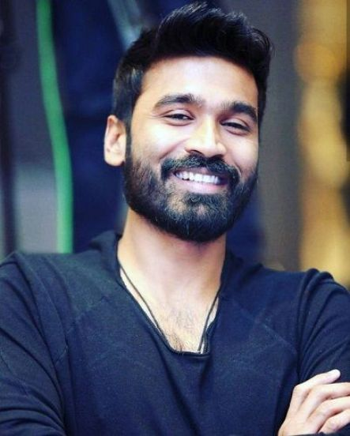

# Image Processing Projects

## 1. Color Detection
**Question:** Sample project for Color detection
**Code:**
```python
# q1.py - Color Detection
import cv2
import numpy as np

def color_detection(image_path):
    image = cv2.imread(image_path)
    hsv = cv2.cvtColor(image, cv2.COLOR_BGR2HSV)
    lower_red = np.array([0, 120, 70])
    upper_red = np.array([10, 255, 255])
    mask = cv2.inRange(hsv, lower_red, upper_red)
    result = cv2.bitwise_and(image, image, mask=mask)
    cv2.imwrite("images/q1_red.png", result)

color_detection("images/input_image.png")
```
**Input Image:**  
  
**Output Image:**  


## 2. T-Pyramid Computation
**Question:** Data structures for Image Analysis - Compute the T-pyramid of an image
**Code:**
```python
# q2.py - T-Pyramid Computation
import cv2

def compute_t_pyramid(image_path):
    image = cv2.imread(image_path, cv2.IMREAD_GRAYSCALE)
    for i in range(4):
        image = cv2.pyrDown(image)
        cv2.imwrite(f"images/q2_level{i+1}.png", image)

compute_t_pyramid("images/input_image.png")
```
**Input Image:**  
  
**Output Images:**  
  
  
  


## 3. Image Smoothing
**Question:** Sample project for Image Smoothing
**Code:**
```python
# q3.py - Image Smoothing
import cv2

def image_smoothing(image_path):
    image = cv2.imread(image_path)
    blurred = cv2.GaussianBlur(image, (5, 5), 0)
    cv2.imwrite("images/q3_smoothed.png", blurred)

image_smoothing("images/input_image.png")
```
**Input Image:**  
  
**Output Image:**  


## 4. Edge Detection (Sobel & Canny)
**Question:** Sample project for Edge detection using Sobel, Canny edge.
**Code:**
```python
# q4.py - Edge Detection (Sobel & Canny)
import cv2
import numpy as np

def edge_detection(image_path):
    image = cv2.imread(image_path, cv2.IMREAD_GRAYSCALE)
    sobelx = cv2.Sobel(image, cv2.CV_64F, 1, 0, ksize=3)
    sobely = cv2.Sobel(image, cv2.CV_64F, 0, 1, ksize=3)
    canny = cv2.Canny(image, 100, 200)
    cv2.imwrite("images/q4_sobelx.png", sobelx)
    cv2.imwrite("images/q4_sobely.png", sobely)
    cv2.imwrite("images/q4_canny.png", canny)

edge_detection("images/input_image.png")
```
**Input Image:**  
  
**Output Images:**  
  
  


## 5. Object Detection
**Question:** Detect simple objects like faces, eyes, or hands using OpenCV and Haar cascades.
**Code:**
```python
# q5.py - Object Detection
import cv2

def object_detection(image_path):
    face_cascade = cv2.CascadeClassifier(cv2.data.haarcascades + 'haarcascade_frontalface_default.xml')
    image = cv2.imread(image_path)
    gray = cv2.cvtColor(image, cv2.COLOR_BGR2GRAY)
    faces = face_cascade.detectMultiScale(gray, 1.1, 4)
    for (x, y, w, h) in faces:
        cv2.rectangle(image, (x, y), (x + w, y + h), (255, 0, 0), 2)
    cv2.imwrite("images/q5_faces.png", image)

object_detection("images/face.png")
```
**Input Image:**  
  
**Output Image:**  

